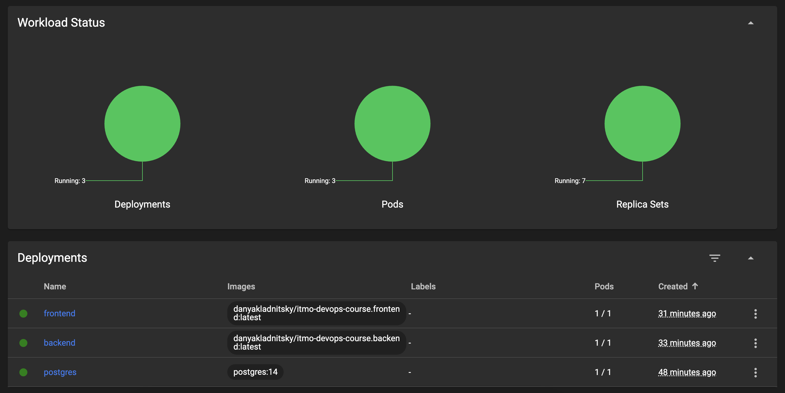

# itmo-devops-course

## Homework 1

### Плохие практики, примененные в Dockerfile.bad

1. Использование :latest при указании базового образа

Опасно указывать всегда новейшую версию образа, так как в момент разворачивания контейнера она может отличаться от раннее используемой разработчиком. Подобное поведение может повлечь за собой ошибки совместимости, баги и тд.

2. Проблема с кэшированием слоев

В моем проекте для сборки фронтенда нужно сначала установить все зависимости из package.json (package-lock.json). В "хорошей" версии Докерфайла, в отличии от "плохой", команда `COPY package*.json ./` вынесена отдельно и выполняется до непосредственного скачивания зависимостей. Это позволяет ускорить сборку образа, ведь если файлы package\*.json не поменялись - значит не зачем выполнять последующие команды (ведь слой перед ними не поменялся). Подобная оптимизация может существенно ускорить процесс создания образа.

3. Использование ADD вместо COPY

ADD-команда более функциональная, нежели COPY, следовательно ее вызов может привести к не ожиданным для разработчика последствиям.

## Homework 2

### Можно ли ограничивать ресурсы (например, память или CPU) для сервисов в docker-compose.yml? Если нет, то почему, если да, то как?
Да, можно с помощью ```memory``` и ```cpus```

### Как можно запустить только определенный сервис из docker-compose.yml, не запуская остальные?

```docker compose up <имя желаемого сервиса>```

## Homework 4
### Настройка базы данных PostgreSQL
Все манипуляции по настройке БД аналогичны с лабораторной работой №3.

### Настройка фронтенда
Был перенесен инит-контейнер из второй лабораторной, также добавлено монтирование volume-а.
В качестве образа используется собранный и добавленный в Dockerhub image с тегом :latest.

## Настройка бэкенда


### Итоговое состояние сервисов
