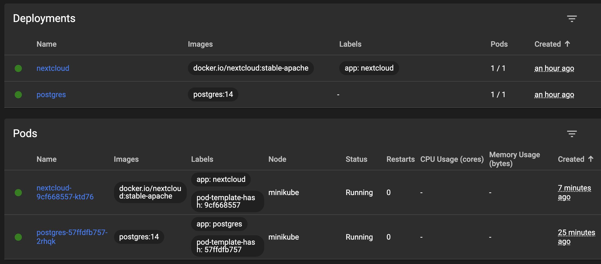
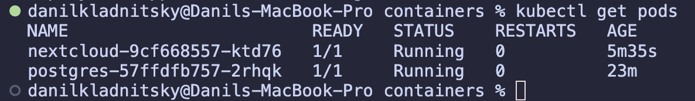

# itmo-devops-course

## Homework 1

### Плохие практики, примененные в Dockerfile.bad

1. Использование :latest при указании базового образа

Опасно указывать всегда новейшую версию образа, так как в момент разворачивания контейнера она может отличаться от раннее используемой разработчиком. Подобное поведение может повлечь за собой ошибки совместимости, баги и тд.

2. Проблема с кэшированием слоев

В моем проекте для сборки фронтенда нужно сначала установить все зависимости из package.json (package-lock.json). В "хорошей" версии Докерфайла, в отличии от "плохой", команда `COPY package*.json ./` вынесена отдельно и выполняется до непосредственного скачивания зависимостей. Это позволяет ускорить сборку образа, ведь если файлы package\*.json не поменялись - значит не зачем выполнять последующие команды (ведь слой перед ними не поменялся). Подобная оптимизация может существенно ускорить процесс создания образа.

3. Использование ADD вместо COPY

ADD-команда более функциональная, нежели COPY, следовательно ее вызов может привести к не ожиданным для разработчика последствиям.

## Homework 2

### Можно ли ограничивать ресурсы (например, память или CPU) для сервисов в docker-compose.yml? Если нет, то почему, если да, то как?

Да, можно с помощью `memory` и `cpus`

### Как можно запустить только определенный сервис из docker-compose.yml, не запуская остальные?

`docker compose up <имя желаемого сервиса>`

## Homework 3

### Ход работы


#### 1. Для постгреса перенести POSTGRES_USER и POSTGRES_PASSWORD из конфигмапы в секреты

Был создан файл `postgres/pg_secrets.yml` с kind `Secret`.

Перенесены переменные, закодированные в base64. В файл `postgres/pg_deployment.yml` подключены через `postgres-secret`:

```yml
envFrom:
  - configMapRef:
      name: postgres-configmap
  - secretRef:
      name: postgres-secret
```

#### 2. Для некстклауда перенести его переменные (NEXTCLOUD_UPDATE, ALLOW_EMPTY_PASSWORD и проч.) из деплоймента в конфигмапу (очевидно, понадобится новый манифест для сущности ConfigMap)

Секреты из `postgres/pg_secrets.yml` были переиспользованы в файле `nextcloud/nextcloud.yml` с помощью той же конструкции.

`NEXTCLOUD_ADMIN_USER`, `NEXTCLOUD_ADMIN_PASSWORD` были вынесены в `nextcloud/nextcloud_secrets.yml`.

Для остальных переменных была создана сущность ConfigMap `nextcloud/nextcloud_configmap.yml`:

```yml
apiVersion: v1
kind: ConfigMap
metadata:
  name: nextcloud-configmap
  labels:
    app: nextcloud
data:
  NEXTCLOUD_TRUSTED_DOMAINS: "127.0.0.1"
  ALLOW_EMPTY_PASSWORD: "yes"
  NEXTCLOUD_UPDATE: "1"
```

#### 3. Для некстклауда добавить Liveness и Readiness пробы

Следующая конфигурация была добавлена `nextcloud/nextcloud.yml`:

```yml
readinessProbe:
  tcpSocket:
    port: 80
  initialDelaySeconds: 5
  periodSeconds: 10
livenessProbe:
  tcpSocket:
    port: 80
  initialDelaySeconds: 15
  periodSeconds: 20
```

#### Результаты



### Вопросы

#### Вопрос: важен ли порядок выполнения этих манифестов? Почему?

Важен, так как развертывание одного компонента может зависеть от наличия другого компонента или уже ранее развернутого ресурса.

#### Вопрос: что (и почему) произойдет, если отскейлить количество реплик postgres-deployment в 0, затем обратно в 1, после чего попробовать снова зайти на Nextcloud?

После скейла реплик до 0 nextcloud теряет предыдущее соединение с БД и возвращает Internal Server Error.

Тем не менее, после скейла реплик до 1 nextcloud все также не будет доступен, хоть БД и функционирует.

Судя по логам, nextcloud не может залогиниться под своим системным аккаунтом в условно "новую" БД, так как, видимо,
nextcloud во время поднятия пода запускает миграции и актуализирует состояние постгреса под свои нужды, в том числе добавляя необходимых юзеров, схемы, таблицы и прочее.

И только после того, как nextcloud будет перезапущен, миграции будет проведены и приложение начнет работать как и ожидается.
